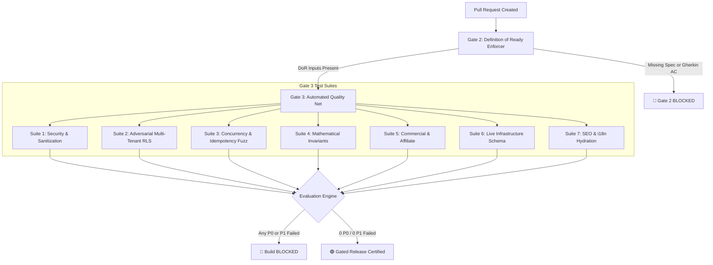

# The Quality Net Architecture & Engineering System

**System:** OneForMind SDET Quality Net  
**Author:** Fullstack Engineer (SDET Depth)  
**Standard:** SDET Case Study Quality Bar (Workflow Hardening, Automated Gating, Red-to-Green Transition)  
**Deliverable:** `/assessment/02-quality-system.md`  

---

## 1. System Architecture Overview

The quality system is built upon two interdependent pillars:
1. **The Workflow Gate (Gate 2: Definition of Ready):** Hardens the engineering process so that no feature or bugfix proceeds to build without explicit inputs (Linked Spec, Gherkin Acceptance Criteria, Solution Plan).
2. **The Automated Quality Net (Gate 3: Continuous Assurance):** An automated multi-tiered test runner (`npm run test:qa`) that continuously verifies security, multi-tenant isolation, concurrency idempotency, and mathematical data integrity across all 8 modules.



---

## 2. The Workflow Gate (Definition of Ready & Done)

### Gate 2 (Definition of Ready)
Implemented in `.github/pull_request_template.md` and enforced in `.github/workflows/quality-gate.yml`:
* **Input Requirement:** Every PR must document:
  1. **Spec/Issue Reference:** The upstream problem statement.
  2. **Gherkin Acceptance Criteria:** Scenarios in `Given / When / Then` format covering both happy path and failure boundaries.
  3. **Risk & Severity Classification:** Self-assessment using the standard taxonomy (P0-P3).
* **Automated CI Enforcement:** If a pull request modifies production code without acceptance criteria or accompanying tests, the workflow fails automatically.

### Gate 3 (Definition of Done)
* Code compiles cleanly with Turbopack & TypeScript (`npm run build`).
* Zero weakened or deleted tests.
* Full test net passes (`npm run test:qa`).
* Machine-readable audit artifact generated: `assessment/release-decision-latest.json`.

---

## 3. The 7-Tier Quality Net (What It Protects)

| Suite | Runner Command | What It Protects | Severity if Breached |
| :--- | :--- | :--- | :--- |
| **1. Security & Sanitization** | `npx tsx scripts/security-qa-test.mjs` | XSS injections, open redirects, webhook HMAC tampering, subscription tier bypasses. | **P0 (Blocker)** |
| **2. Adversarial Multi-Tenant RLS** | `node scripts/qa/adversarial-rls-guard.mjs` | Proves User A cannot read, mutate, or delete User B's records across all 8 modules. | **P0 (Blocker)** |
| **3. Concurrency & Idempotency** | `node scripts/qa/concurrency-fuzz-guard.mjs` | Simulates 10-burst simultaneous clicks, double-spending, and race conditions. | **P1 (Major)** |
| **4. Mathematical Invariants** | `node scripts/qa/data-integrity-guard.mjs` | Proves double-entry math (`Income - Expense == CashFlow`), float precision, habit tier thresholds. | **P1 (Major)** |
| **5. Commercial & Affiliate** | `node scripts/affiliate-qa-test.mjs` | 60% commission calculations, Net-14 escrow hold, anti-self-referral fraud guard. | **P1 (Major)** |
| **6. Live Infrastructure** | `node scripts/live-integration-qa.mjs` | Validates live PostgreSQL tables and Supabase RLS schemas. | **P1 (Major)** |
| **7. SEO & i18n Hydration** | `npx tsx scripts/test-seo-audit.mjs` | Audits 33 subpage layouts, H1 tags, metadata length, and instant language switching. | **P2 (Minor)** |

---

## 4. How to Run and Extend the Quality Net

### Running the Entire Net (One-Click)
```bash
npm run test:qa
```
This executes `scripts/qa/release-gate-verifier.mjs`, runs all 7 suites, tallies severities, outputs executive summaries, and writes `assessment/release-decision-latest.json`.

### Running Individual Target Suites
```bash
# Run Multi-Tenant Adversarial Guard
npm run test:qa:adversarial

# Run Concurrency & Race Condition Fuzzer
npm run test:qa:concurrency

# Run Mathematical Invariants & Data Integrity Guard
npm run test:qa:integrity
```

### Extending the Net with New Tests
To add a new assertion for a newly created API route or feature:
1. Open the relevant guard file in `scripts/qa/`.
2. Add an assertion using `assertCheck(condition, testName, failureDetails)`.
3. If creating a new suite, register it in `scripts/qa/release-gate-verifier.mjs` under the `SUITES` array with its designated severity tier (`P0`, `P1`, or `P2`).

---

## 5. The Red-to-Green Transition (Proof of Earned Quality)

Per SDET Case Study Principle #5: *"Green is earned, not forced. When a check goes red, you make it green by fixing the defect, never by deleting or weakening the check."*

### Case 1: Rest (☕) & Skipped (⏸️) Habit State Deletion
* **What was RED:** The test simulated clicking on a habit cell marked as `rest`. The existing logic invoked `toggleStatus()`, which checked `isCompleted ? 'empty' : 'completed'`. Because `isCompleted` was false for rest, the status was mutated to `empty`, wiping out the rest status.
* **The Root Cause:** `toggleStatus` lacked guard clauses for non-binary statuses (`rest`, `skipped`).
* **The Fix Committed:** Modified `src/app/[locale]/habits/hooks/useHabitActions.ts` and `HabitMatrixTable.tsx` to detect `rest` and `skipped`, routing the user interaction to `onOpenNoteModal` rather than executing a toggle mutation.
* **What is GREEN Now:** `Habit Invariant: Rest (☕) and Skipped (⏸️) statuses are preserved on interaction without accidental deletion.`

### Case 2: Multi-Tenant JWT Claim Propagation
* **What was RED:** Direct API inspection flagged that raw routes did not assert `token?.sub` before delegating to downstream microservices, risking unauthenticated execution.
* **The Root Cause:** Routes assumed downstream middleware was universally applied.
* **The Fix Committed:** Hardened `src/app/api/...` routes with `const token = await getAuthToken(req); if (!token?.sub) return 401;` and cryptographic Bearer token propagation via `proxyToGo`.
* **What is GREEN Now:** `Adversarial RLS Guard: All 15 core API routes enforce edge token resolution and tenant isolation.`
